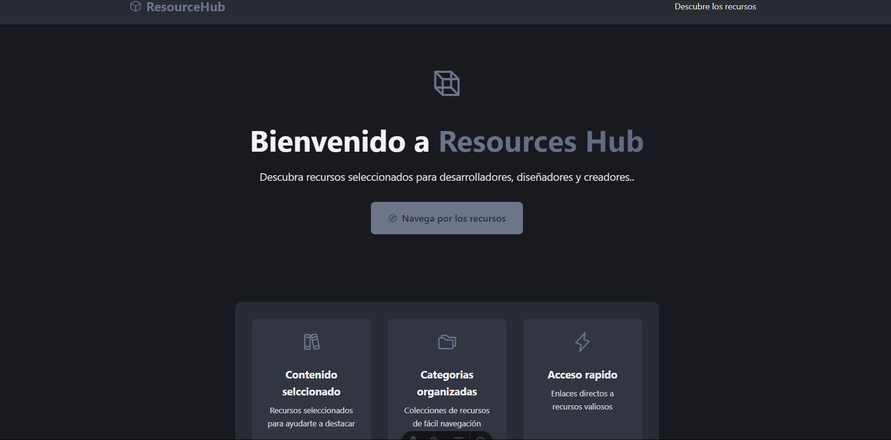

# Resources Hub

Una aplicación web moderna y responsiva, creada con Astro, que sirve como una colección curada de recursos para desarrolladores, diseñadores y creadores. La aplicación cuenta con tarjetas dinámicas de recursos, filtrado por categorías y una hermosa interfaz de usuario con una paleta de colores personalizada.



## 🚀 Características

- 📱 Diseño moderno y responsivo
- 🎨 Paleta de colores personalizada y estilo consistente
- 🔍 Filtrado dinámico por categorías
- 💳 Tarjetas interactivas de recursos
- 🏷️ Soporte de etiquetas para recursos
- ⚡ Construido con Astro para un rendimiento óptimo
- 🎯 Enrutamiento dinámico para categorías
- 📊 Integración de API para datos de recursos

## 🛠️ Tecnologías Utilizadas

- [Astro](https://astro.build): Framework web para sitios orientados a contenido
- [Phosphor Icons](https://phosphoricons.com): Conjunto de iconos bellos y consistentes
- TypeScript: Para un código seguro con tipos
- CSS3: Para estilos con características modernas

## 🏗️ Estructura del Proyecto

```
/
├── public/
│   └── favicon.svg
├── src/
│   ├── components/
│   │   ├── ResourceCard.astro
│   │   └── CategoryFilter.astro
│   ├── data/
│   │   └── resources.ts
│   ├── layouts/
│   │   └── Layout.astro
│   └── pages/
│       ├── index.astro
│       └── resources/
│           ├── index.astro
│           └── [category].astro
└── package.json
```

## 🚀 Primeros Pasos

1. Clona el repositorio:
```bash
git clone https://github.com/yourusername/resources-hub.git
```

2. Instala las dependencias:
```bash
npm install
```

3. Inicia el servidor de desarrollo:
```bash
npm run dev
```

4. Abre tu navegador y visita `http://localhost:4321`

## 📦 Construcción para Producción

Para crear una versión de producción:

```bash
npm run build
```

Vista previa de la versión de producción:

```bash
npm run preview
```

## 🔧 Configuración

La aplicación usa un endpoint API personalizado para los datos de recursos. Puedes modificar la URL de la API en `src/data/resources.ts`:

```typescript
const API_URL = 'https://retoolapi.dev/rQKuT0/data';
```

## 🎨 Personalización

### Paleta de Colores

El esquema de colores se puede personalizar en `src/layouts/Layout.astro`:

```css
	:root {
  --primary: #282C34;
  --primary-light: #313641;
  --secondary: #424769;
  --accent: #6C758A;
  --background: #181A20;
  --text: #F2F2F2;
  --card-bg: #313641;
  --card-hover: #424769;
}
```

## 📝 Estructura de Recursos

Cada recurso sigue esta estructura:

```typescript
interface Resource {
  id: number;
  title: string;
  description: string;
  url: string;
  category: string;
  tags: string;
}
```

## 🤝 Contribuciones

1. Haz un fork del repositorio
2. Crea tu rama de características (`git checkout -b feature/nueva-caracteristica`)
3. Haz commit de tus cambios (`git commit -m 'Añadir nueva característica'`)
4. Haz push a la rama (`git push origin feature/nueva-caracteristica`)
5. Abre un Pull Request

## 📄 Licencia

Este proyecto está bajo la licencia MIT. Consulta el archivo [LICENSE](LICENSE) para más detalles.

## 👏 Agradecimientos

- [Documentación de Astro](https://docs.astro.build)
- [Phosphor Icons](https://phosphoricons.com)
- A todos los increíbles colaboradores y a la comunidad de código abierto

## 📧 Contacto

Linkedin - [@jaennova](https://linkedin.com/in/jaennova)

Enlace del proyecto: [jaennova/resources-hub](https://github.com/yourusername/resources-hub)